# Web/ELK Server - Cloud Configuration

### Background

Understanding and building on the cloud is something that many people have not had exposure with, since it can be expensive and complicated. Thanks to resources like Amazon's AWS or Microsoft Azure, it is now easier than ever to spin up your own servers and networks within a cloud environment. In enterprise environments in particular, this capability can significantly reduce the risks involved with hosting your own infrastructures at scale.

In this project, we have taken advantage of Microsoft's Azure platform in order to build out a resource group consisting of two shared virtual networks, two load balanced web servers, an ELK monitoring server, and a secure jump box to SSH between them and automate server setup using Ansible - all taking advantage of docker.io and secured via our own network security rules. 

As a reference, the network diagram below outlines our cloud resources and the interactions between them. Please use this diagram as a reference to better visualize our cloud infrastructure. 

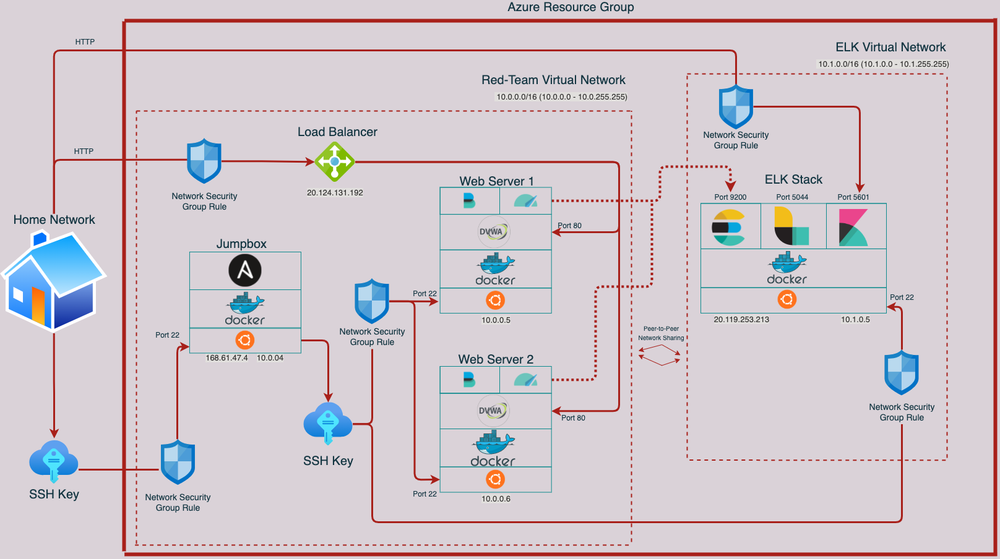

### Overview

Lets start by explaining why we would want to build out this specific network. In this case, we will prop up two load balanced web servers which will both host DVWA (Damn Vulnerable Web Application). Later, we will be exploiting the many vulnerabilities of this site, but for now let's focus on building out the infrastructure needed to host it.  

In addition to our web servers, we will also need a monitoring server, which in this case will utilize three open source software modules called (E)lasticsearch, (L)ogstash, and (K)ibana. This stack of software is commonly referred to as ELK. These three modules - when combined - give us the ability to search and monitor the logs of our website within a useful web interface. 

Last but not least, we have our Jumpbox server which allows us to 'jump' between these various web/monitoring servers and automate setup tasks using Ansible. By having a single access point, it provides better control over the network and adds an additional layer of security. If you can manage the Jumpbox, you can manage the network. 

### Getting Going

In order to get started, we will need to setup our cloud infrastructure. Since this process is unique to the cloud platform that is being used, I will provide a high level overview of the actions that are being taken and why. 

We first must start by creating our resource group. This resource group will contain all of the resources that we need for this project. In this case, we named our resource group "Red-Team" since we will eventually be pen testing these servers. 

Once we have our resource group, we can create our virtual network. In the network diagram above, we can see two different virtual networks. This first one we create will be that "Red Team Virtual Network". 

After we have our virtual network, we will go ahead and create a network security group which will allow us to configure firewall rules. 

Next, let's create our Jumpbox VM. In order secure this Jumpbox, we will opt for an SSH public key as opposed to a password. This will make it much harder for anyone besides us to get into this Jumpbox. We can go ahead and run `ssh-keygen` on our host machine which will generate a public and a private key for us which is stored in our `~/.ssh/` directory. We can go ahead and copy our public key into the key area in our VM setup. Additionally, let's make sure we setup a public IP for our Jumpbox so that we can actually SSH into it. 

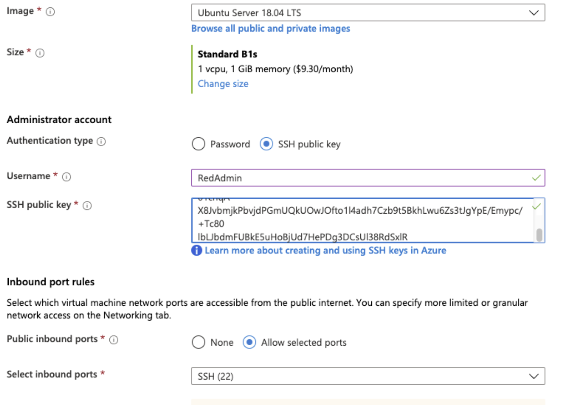

Next, we can create two more VMs which will act as our web servers. When setting these up, be sure to run that `ssh-keygen` command on the Jumpbox and not the host. We do not want our host to be able to connect directly to the web servers, since that is the job of the Jumpbox. Additionally, be sure to keep these web server's IP addresses private for now. Later, we will set up a load balancer which will provide the public IPs for these servers. 

Now that we have our VMs set up, we should go ahead and configure our security rules. By default, Azure will block all incoming traffic, so we will need to set up an inbound rule that allows TCP traffic on port 22 in order to allow us to SSH into the machines. 

Once this is all setup, we should have our own resource group, a virtual network within that resource group, one Jumpbox VM, two web server VM's, and network security rules that allow us to SSH into everything. 

### Propping Up DVWA 

Now that we have our machines setup, lets get started with getting our site up and running. To do this, we will use docker.io to compartmentalize the websites resources within our web server, as well as using Ansible to automate the setup. 

First, let get into our Jumpbox. From here, we can install docker with `sudo apt install docker.io`. Once it is installed and running we will pull our Ansible container with `sudo docker pull [Ansible container]`. 

We will then launch the Ansible container and attach using `docker run -ti [ansible container]:latest bash`. This will spawn a new bash session as root of the Ansible container. 

In order for Ansible to run our commands, it will need to be able to connect to the web servers via SSH. In this case, we will need do another `ssh-keygen` but this time while we are attached to our Ansible container. We can then go back into Azure and reset the SSH public keys to the ones that we just created. Once complete, test if you are able to SSH into both web servers from the Ansible containers. 

We will now navigate to `/etc/ansible/` from our Ansible container in order to prepare Ansible to run our commands. We will start by editing the `hosts` file, and add our web servers IP address followed by "ansible_python_interpreter=/usr/bin/python3"

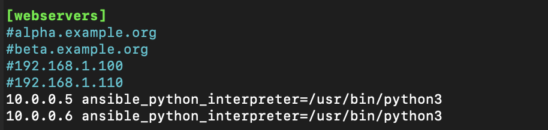

We will then edit the `ansible.cfg` file to add the username needed to SSH into the web servers. This is done by commenting out the `remote_user` line.

Example:

    ```bash
    # What flags to pass to sudo
    # WARNING: leaving out the defaults might create unexpected behaviours
    #sudo_flags = -H -S -n

    # SSH timeout
    #timeout = 10

    # default user to use for playbooks if user is not specified
    # (/usr/bin/ansible will use current user as default)
    remote_user = sysadmin

    # logging is off by default unless this path is defined
    # if so defined, consider logrotate
    #log_path = /var/log/ansible.log

    # default module name for /usr/bin/ansible
    #module_name = command

    ```

You can test if Ansible will be able to work by running `ansible all -m ping`. If you used `ansible_python_interpreter=/usr/bin/python3` your output should look like:

```bash
10.0.0.5 | SUCCESS => {
"changed": false, 
"ping": "pong"
}
10.0.0.6 | SUCCESS => {
"changed": false, 
"ping": "pong"
}
```

Finally, we are ready to setup our Ansible playbook. This will contain all of the commands we need to setup our DVWA site on both of the web servers simultaneously. 

---pentest.yml---

Now that we have our playbook we can run it with `ansible-playbook pentest.yml`. If successful, we can SSH into our web servers and run `curl localhost/setup.php`. If any html is returned, we know that our site was successfully installed. While we are in the web servers, lets run `sudo docker update -- restart always [container ID]`. This will automatically restart the websites container anytime the web server is rebooted. 

Now that we have our site, the final step is to setup our load balancer so that we can actually connect to it. In Azure, we will create a new load balancer which should have its own Public IP. From there we setup a health probe to regularly check all the VMs and make sure they are able to receive traffic. Finally, we will create a backend pool and add both of our web servers. 

Once that is done, we can add a network security group rule that allows TCP traffic on port 80, and we should then be able to connect to the public IP of our load balancer. 

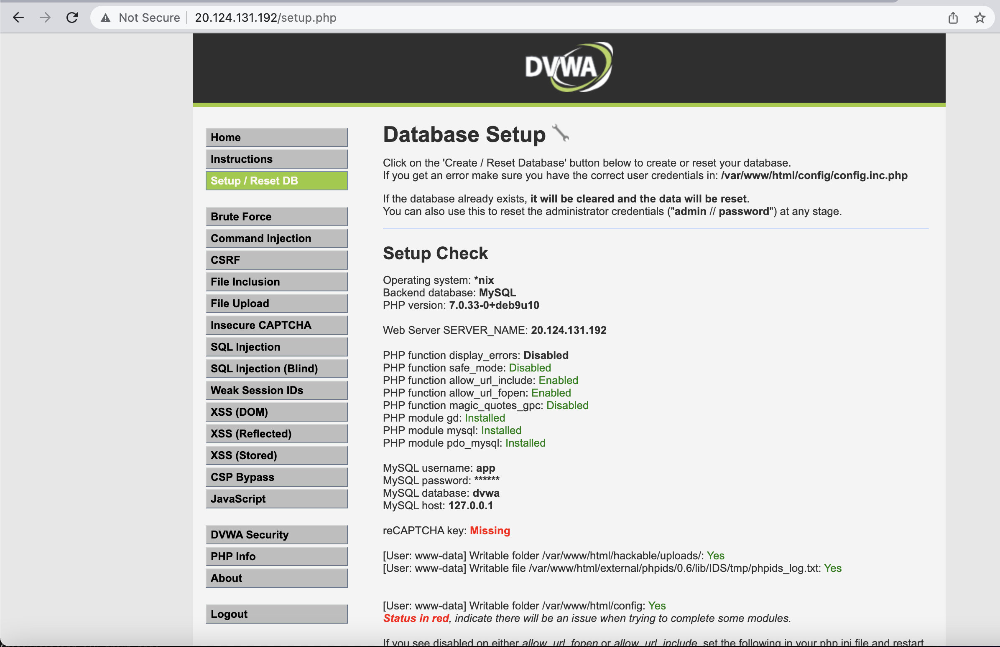


### ELK Stack

Now that we have our website up and running, we will want to start monitoring the sites' traffic. To do so, let's setup our ELK stack. 

In this case, we will be setting up a new virtual network along with a new virtual server and configuring them in essentially the same way as the web servers, so I will go ahead and skip through those steps for the sake of time management. Please reference the network diagram in order to see exactly how our ELK Virtual Network looks in relation to the Red-Team Virtual Network. 

Once we have our network configured the way we want, we can start configuring Ansible which will allow us to automate the ELK stack deployment. 

Let's begin by getting onto our Jumpbox. From there, we will attach to our Ansible container which will allow us to begin our setup. 

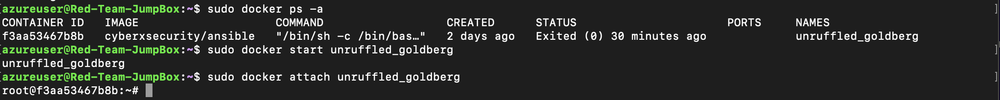

Once we are attached, we will need to navigate back to our `/etc/ansible/hosts` file in order to add the new ELK VMs IP address as a new host group. This will give Ansible the ability to SSH into the machine and run our playbook.

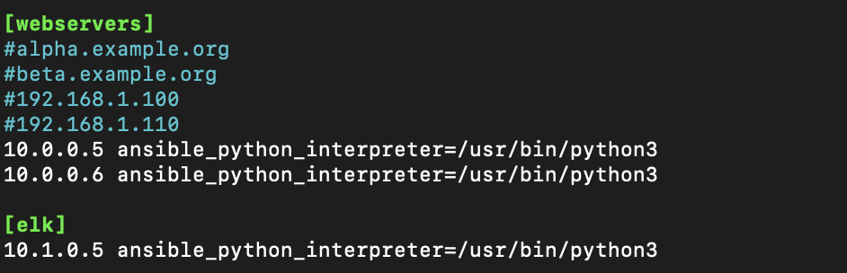

Once we have our new server added, we can go ahead and set up our YAML playbook. 

At a high level, our playbook is installing docker, pulling the preconfigured elk container, establishing the ports that ELK will run on, and enabling docker on reboot. 

---Please see the ELK playbook here---

Once the playbook has been created, we can go ahead and run it with `ansible-playbook install-elk.yml`. If successful, it should return no error messages. 

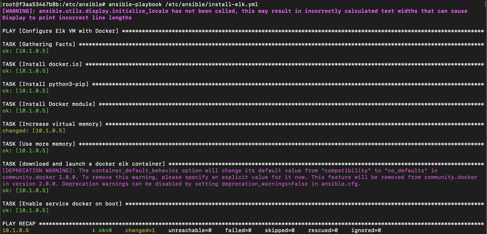

In order to confirm a successful setup Lets SSH into our ELK VM and check. We can run `sudo docker ps -a` in order to see the status of all of the containers. In our case, we can see that the container is "up 8 minutes" which is a good sign. 

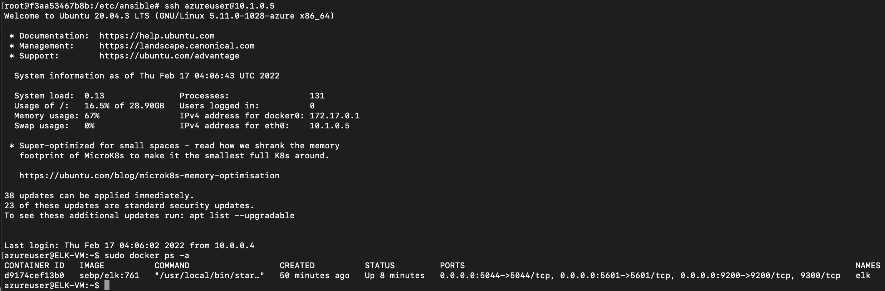

Now, if we have configured our security rules correctly (in this case will want a tcp connection to be allowed on port 5601), we should be able to jump into our browser and visit the Kibana page. 

The URL will look like: `http://[your.ELK-VM.External.IP]:5601/app/kibana`

Since we currently do not have any data, our site should look something like this...

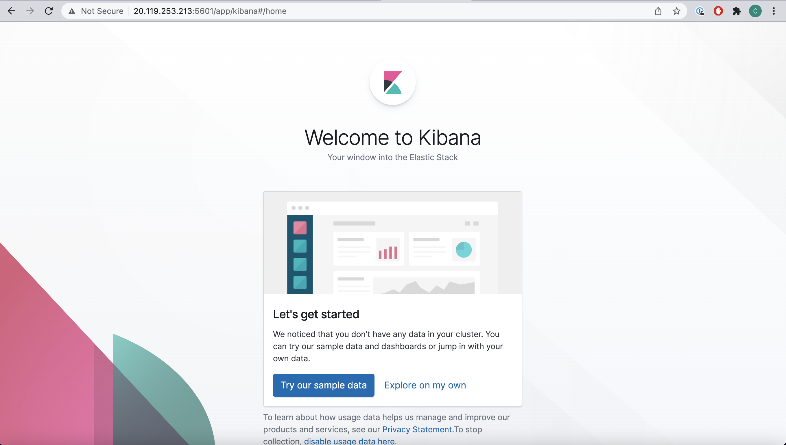


### File/Metric Beat - Log Setup

In order for ELK to be useful as a monitoring service, we will need to begin sending it data from our web servers. In order to do so, we will add both Filebeat and Metricbeat to our two web servers ontop of the web service that is already running. 

Essentially, these two services are used to collect logs from specific files that are useful to us. In this case, we will be collecting logs from our Apache server and MySQL database that are generated by DWVA. 

The instructions for installing these services can be found on the Kibana GUI under `Add Log Data > System Logs` and selecting the Linux instructions. Additionally, Metricbeat instructions can be found under `Add Metric Data > Docker Metrics`. 

We will be following a similar process for both of these services, so let's get started! 

Just like before, we will need to get onto our Jumpbox. From there, we can attach to our Ansible container and lets navigate to our `/etc/ansible/` directory. In order to get started we will need to setup the configuration files. To do so, we will simply run the following curl commands for Filebeat and Metricbeat respectfully. 

Filebeat: `curl https://gist.githubusercontent.com/slape/5cc350109583af6cbe577bbcc0710c93/raw/eca603b72586fbe148c11f9c87bf96a63cb25760/Filebeat > /etc/ansible/files/filebeat-config.yml`

Metricbeat: `curl https://gist.githubusercontent.com/slape/58541585cc1886d2e26cd8be557ce04c/raw/0ce2c7e744c54513616966affb5e9d96f5e12f73/metricbeat > /etc/ansible/files/metricbeat-config.yml`

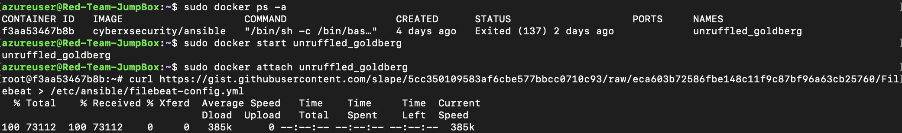

Once we have our two config files, we can go ahead and edit them to contain the correct information. The Filebeat file will be much larger, so the items we need to change can be found on line #1106 and #1806. The IP addresses here will need to be the internal IP of the ELK machine. The Metricbeat files is much smaller, and can be configured in the same way. 

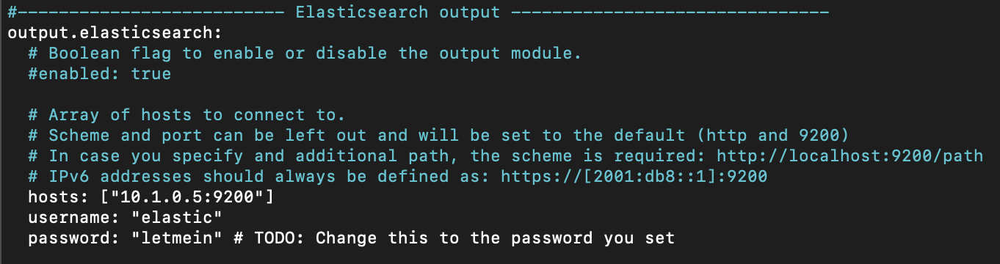

Once we have updated our config files, we can now start with our Ansible playbooks. Lets add these playbooks into a new directory `/etc/ansible/roles`. In this new directory we will add the new files called `filebeat-playbook.yml` and `metricbeat-playbook.yml`. 

These files will be similar to one another, but at a high level they will be downloading the correct .deb file, installing the package using `dpkg`, copying our config files into the web servers, then running filebeat's setup commands that are specified in the instructions. 

The two YAML playbooks can be found here!

---filebeat-playbook.yml---
---metricbeat-playbook.yml---

Once everything is ready to go, we can run our playbooks from the `/roles/` directory. If successful, we should see no errors. 


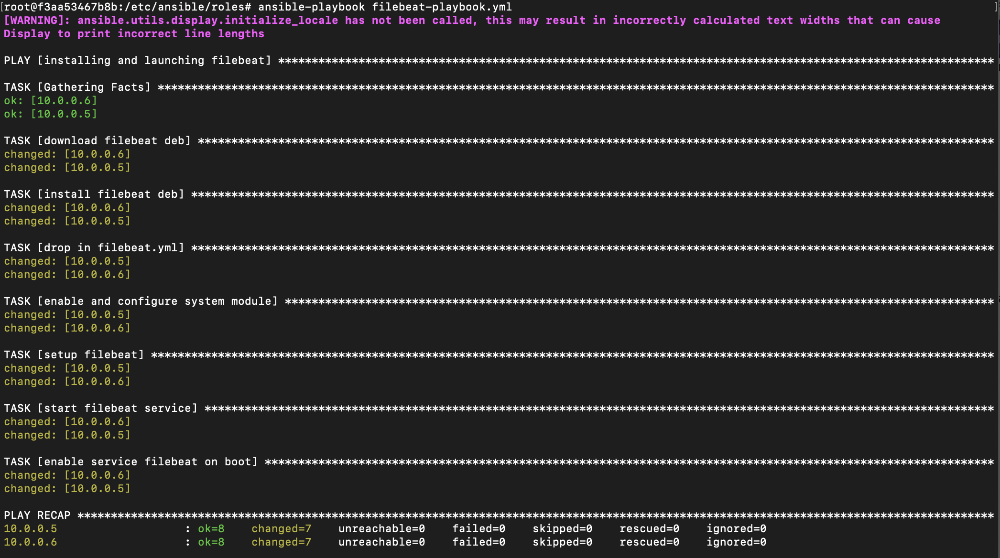

Once both playbooks have been successfully run, we can verify our installation of these services by taking a look back at the instructions on the Kibana GUI. If we scroll down to step #5, we can click on "Check Data". If that is successful, we can also click on "View Dashboard" which will take you to the respective dashboards, which might look similar to the ones below. 

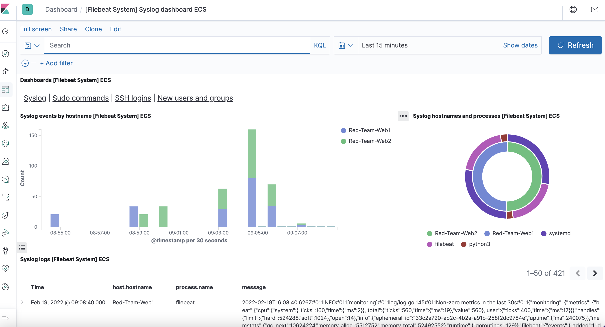
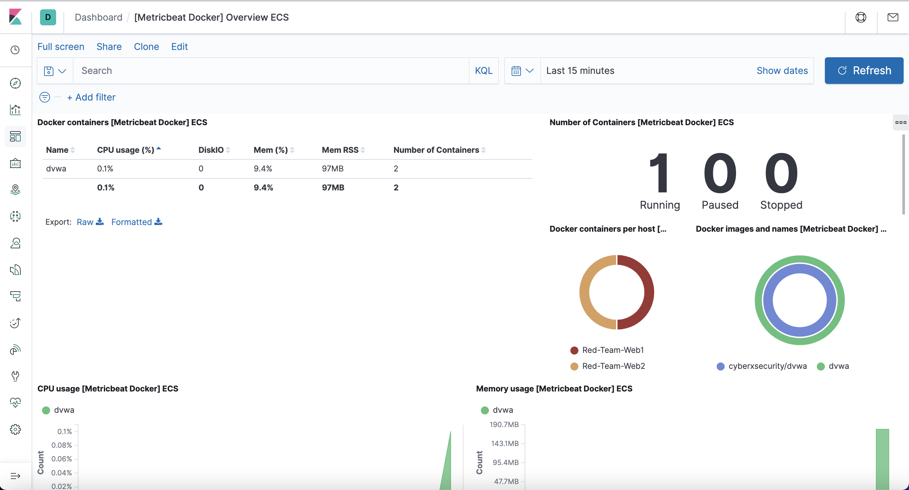

### Conclusion

And just like that, we have setup a secure and functioning cloud network on Azure, propped up a website using Ansible automation, configured an external ELK monitoring server, and installed monitoring functionality on the web servers themselves. 

This was alot of information and several tools all being used here, but my hope is that we can understand these tools and why they are so useful for professionals. 

### Tools Used

Azure: This platform allows us to build on Microsoft's existing infrastructure without the need for our own physical machines. In this case we were able to build a network of machines with their own firewall rules and functionalities. 

Docker: This lightweight tool lets us virtualize our operating system and add compartmentalized services on top of our host OS. In our applications here we added Ansible, a DVWA site, an ELK stack, and our two logging services

Ansible: This automation tool allows us to SSH into all of our machines at once and configure anything we want by using a preconfigured set of commands. Useful in this case for deploying multiple mirrored web servers simultaneously 

ELK: This stack allows us to monitor our web server's logs to give us better insights into the site.

File/Metricbeat: These services allow the logs from our web servers to be sent over to the ELK stack itself to be further analyzed by the ELK functionality. 
